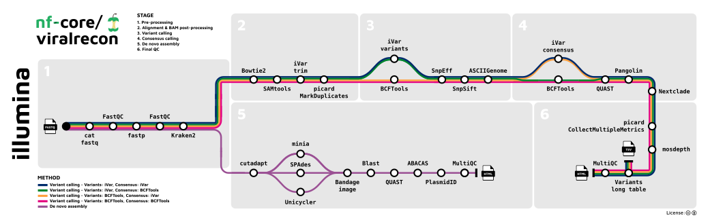
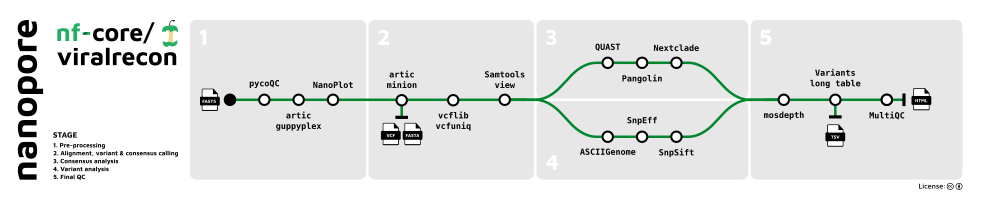

## Introduction

**nf-core/viralrecon** is a bioinformatics analysis pipeline used to perform assembly and intra-host/low-frequency variant calling for viral samples. The pipeline supports both Illumina and Nanopore sequencing data. For Illumina short-reads the pipeline is able to analyse metagenomics data typically obtained from shotgun sequencing (e.g. directly from clinical samples) and enrichment-based library preparation methods (e.g. amplicon-based: [ARTIC SARS-CoV-2 enrichment protocol](https://artic.network/ncov-2019); or probe-capture-based). For Nanopore data the pipeline only supports amplicon-based analysis obtained from primer sets created and maintained by the [ARTIC Network](https://artic.network/).

On release, automated continuous integration tests run the pipeline on a full-sized dataset on the AWS cloud infrastructure. This ensures that the pipeline runs on AWS, has sensible resource allocation defaults set to run on real-world datasets, and permits the persistent storage of results to benchmark between pipeline releases and other analysis sources. The results obtained from running the full-sized tests individually for each `--platform` option can be viewed on the [nf-core website](https://nf-co.re/viralrecon/results) and the output directories will be named accordingly i.e. `platform_illumina/` and `platform_nanopore/`.

The pipeline is built using [Nextflow](https://www.nextflow.io), a workflow tool to run tasks across multiple compute infrastructures in a very portable manner. It uses Docker/Singularity containers making installation trivial and results highly reproducible. The [Nextflow DSL2](https://www.nextflow.io/docs/latest/dsl2.html) implementation of this pipeline uses one container per process which makes it much easier to maintain and update software dependencies. Where possible, these processes have been submitted to and installed from [nf-core/modules](https://github.com/nf-core/modules) in order to make them available to all nf-core pipelines, and to everyone within the Nextflow community!

## Pipeline summary

The pipeline has numerous options to allow you to run only specific aspects of the workflow if you so wish. For example, for Illumina data you can skip the host read filtering step with Kraken 2 with `--skip_kraken2` or you can skip all of the assembly steps with the `--skip_assembly` parameter. See the [usage](https://nf-co.re/viralrecon/usage) and [parameter](https://nf-co.re/viralrecon/parameters) docs for all of the available options when running the pipeline.

The SRA download functionality has been removed from the pipeline (`>=2.1`) and ported to an independent workflow called [nf-core/fetchngs](https://nf-co.re/fetchngs). You can provide `--nf_core_pipeline viralrecon` when running nf-core/fetchngs to download and auto-create a samplesheet containing publicly available samples that can be accepted directly by the Illumina processing mode of nf-core/viralrecon.

A number of improvements were made to the pipeline recently, mainly with regard to the variant calling. Please see [Major updates in v2.3](https://github.com/nf-core/viralrecon/issues/271) for a more detailed description.

### Illumina



1. Merge re-sequenced FastQ files ([`cat`](http://www.linfo.org/cat.html))
2. Read QC ([`FastQC`](https://www.bioinformatics.babraham.ac.uk/projects/fastqc/))
3. Adapter trimming ([`fastp`](https://github.com/OpenGene/fastp))
4. Removal of host reads ([`Kraken 2`](http://ccb.jhu.edu/software/kraken2/); _optional_)
5. Variant calling
   1. Read alignment ([`Bowtie 2`](http://bowtie-bio.sourceforge.net/bowtie2/index.shtml))
   2. Sort and index alignments ([`SAMtools`](https://sourceforge.net/projects/samtools/files/samtools/))
   3. Primer sequence removal ([`iVar`](https://github.com/andersen-lab/ivar); _amplicon data only_)
   4. Duplicate read marking ([`picard`](https://broadinstitute.github.io/picard/); _optional_)
   5. Alignment-level QC ([`picard`](https://broadinstitute.github.io/picard/), [`SAMtools`](https://sourceforge.net/projects/samtools/files/samtools/))
   6. Genome-wide and amplicon coverage QC plots ([`mosdepth`](https://github.com/brentp/mosdepth/))
   7. Choice of multiple variant callers ([`iVar variants`](https://github.com/andersen-lab/ivar); _default for amplicon data_ _||_ [`BCFTools`](http://samtools.github.io/bcftools/bcftools.html); _default for metagenomics data_)
      - Variant annotation ([`SnpEff`](http://snpeff.sourceforge.net/SnpEff.html), [`SnpSift`](http://snpeff.sourceforge.net/SnpSift.html))
      - Individual variant screenshots with annotation tracks ([`ASCIIGenome`](https://asciigenome.readthedocs.io/en/latest/))
   8. Choice of multiple consensus callers ([`BCFTools`](http://samtools.github.io/bcftools/bcftools.html), [`BEDTools`](https://github.com/arq5x/bedtools2/); _default for both amplicon and metagenomics data_ _||_ [`iVar consensus`](https://github.com/andersen-lab/ivar))
      - Consensus assessment report ([`QUAST`](http://quast.sourceforge.net/quast))
      - Lineage analysis ([`Pangolin`](https://github.com/cov-lineages/pangolin))
      - Clade assignment, mutation calling and sequence quality checks ([`Nextclade`](https://github.com/nextstrain/nextclade))
   9. Relative lineage abundance analysis from mixed SARS-CoV-2 samples ([`Freyja`](https://github.com/andersen-lab/Freyja))
   10. Create variants long format table collating per-sample information for individual variants ([`BCFTools`](http://samtools.github.io/bcftools/bcftools.html)), functional effect prediction ([`SnpSift`](http://snpeff.sourceforge.net/SnpSift.html)) and lineage analysis ([`Pangolin`](https://github.com/cov-lineages/pangolin))
6. _De novo_ assembly
   1. Primer trimming ([`Cutadapt`](https://cutadapt.readthedocs.io/en/stable/guide.html); _amplicon data only_)
   2. Choice of multiple assembly tools ([`SPAdes`](http://cab.spbu.ru/software/spades/) _||_ [`Unicycler`](https://github.com/rrwick/Unicycler) _||_ [`minia`](https://github.com/GATB/minia))
      - Blast to reference genome ([`blastn`](https://blast.ncbi.nlm.nih.gov/Blast.cgi?PAGE_TYPE=BlastSearch))
      - Contiguate assembly ([`ABACAS`](https://www.sanger.ac.uk/science/tools/pagit))
      - Assembly report ([`PlasmidID`](https://github.com/BU-ISCIII/plasmidID))
      - Assembly assessment report ([`QUAST`](http://quast.sourceforge.net/quast))
7. Present QC and visualisation for raw read, alignment, assembly and variant calling results ([`MultiQC`](http://multiqc.info/))

### Nanopore



1. Sequencing QC ([`pycoQC`](https://github.com/a-slide/pycoQC))
2. Aggregate pre-demultiplexed reads from MinKNOW/Guppy ([`artic guppyplex`](https://artic.readthedocs.io/en/latest/commands/))
3. Read QC ([`NanoPlot`](https://github.com/wdecoster/NanoPlot))
4. Align reads, call variants and generate consensus sequence ([`artic minion`](https://artic.readthedocs.io/en/latest/commands/))
5. Remove unmapped reads and obtain alignment metrics ([`SAMtools`](https://sourceforge.net/projects/samtools/files/samtools/))
6. Genome-wide and amplicon coverage QC plots ([`mosdepth`](https://github.com/brentp/mosdepth/))
7. Downstream variant analysis:
   - Count metrics ([`BCFTools`](http://samtools.github.io/bcftools/bcftools.html))
   - Variant annotation ([`SnpEff`](http://snpeff.sourceforge.net/SnpEff.html), [`SnpSift`](http://snpeff.sourceforge.net/SnpSift.html))
   - Consensus assessment report ([`QUAST`](http://quast.sourceforge.net/quast))
   - Lineage analysis ([`Pangolin`](https://github.com/cov-lineages/pangolin))
   - Clade assignment, mutation calling and sequence quality checks ([`Nextclade`](https://github.com/nextstrain/nextclade))
   - Individual variant screenshots with annotation tracks ([`ASCIIGenome`](https://asciigenome.readthedocs.io/en/latest/))
   - Recover relative lineage abundances from mixed SARS-CoV-2 samples ([`Freyja`](https://github.com/andersen-lab/Freyja))
   - Create variants long format table collating per-sample information for individual variants ([`BCFTools`](http://samtools.github.io/bcftools/bcftools.html)), functional effect prediction ([`SnpSift`](http://snpeff.sourceforge.net/SnpSift.html)) and lineage analysis ([`Pangolin`](https://github.com/cov-lineages/pangolin))
8. Present QC, visualisation and custom reporting for sequencing, raw reads, alignment and variant calling results ([`MultiQC`](http://multiqc.info/))

## Usage

> [!NOTE]
> If you are new to Nextflow and nf-core, please refer to [this page](https://nf-co.re/docs/usage/installation) on how
> to set-up Nextflow. Make sure to [test your setup](https://nf-co.re/docs/usage/introduction#how-to-run-a-pipeline)
> with `-profile test` before running the workflow on actual data.

First, prepare a samplesheet with your input data that looks as follows:

`samplesheet.csv`:

```csv
sample,fastq_1,fastq_2
SAMPLE_1,AEG588A1_S1_L002_R1_001.fastq.gz,AEG588A1_S1_L002_R2_001.fastq.gz
```

Each row represents a fastq file (single-end) or a pair of fastq files (paired end). Rows with the same sample identifier are considered technical replicates and merged automatically.

### Typical commands

#### Illumina shotgun analysis

```bash
nextflow run nf-core/viralrecon \
   --input samplesheet.csv \
   --outdir <OUTDIR> \
   --platform illumina \
   --protocol metagenomic \
   --genome 'MN908947.3' \
   -profile -profile <docker/singularity/.../institute>
```

#### Illumina amplicon analysis

```bash
nextflow run nf-core/viralrecon \
   --input samplesheet.csv \
   --outdir <OUTDIR> \
   --platform illumina \
   --protocol amplicon \
   --genome 'MN908947.3' \
   --primer_set artic \
   --primer_set_version 3 \
   --skip_assembly \
   -profile -profile <docker/singularity/.../institute>
```

#### Nanopore amplicon analysis:

```bash
nextflow run nf-core/viralrecon \
   --input samplesheet.csv \
   --outdir <OUTDIR> \
   --platform nanopore \
   --genome 'MN908947.3' \
   --primer_set 'artic' \
   --primer_set_version 3 \
   --fastq_dir fastq_pass/ \
   --fast5_dir fast5_pass/ \
   --sequencing_summary sequencing_summary.txt \
   -profile -profile <docker/singularity/.../institute>
```

> [!WARNING]
> Please provide pipeline parameters via the CLI or Nextflow `-params-file` option. Custom config files including those provided by the `-c` Nextflow option can be used to provide any configuration _**except for parameters**_;
> see [docs](https://nf-co.re/usage/configuration#custom-configuration-files).

For more details and further functionality, please refer to the [usage documentation](https://nf-co.re/viralrecon/usage) and the [parameter documentation](https://nf-co.re/viralrecon/parameters).

## Citations

If you use nf-core/viralrecon for your analysis, please cite it using the following doi: [10.5281/zenodo.3901628](https://doi.org/10.5281/zenodo.3901628)

An extensive list of references for the tools used by the pipeline can be found in the [`CITATIONS.md`](CITATIONS.md) file.

You can cite the `nf-core` publication as follows:

> **The nf-core framework for community-curated bioinformatics pipelines.**
>
> Philip Ewels, Alexander Peltzer, Sven Fillinger, Harshil Patel, Johannes Alneberg, Andreas Wilm, Maxime Ulysse Garcia, Paolo Di Tommaso & Sven Nahnsen.
>
> _Nat Biotechnol._ 2020 Feb 13. doi: [10.1038/s41587-020-0439-x](https://dx.doi.org/10.1038/s41587-020-0439-x).
